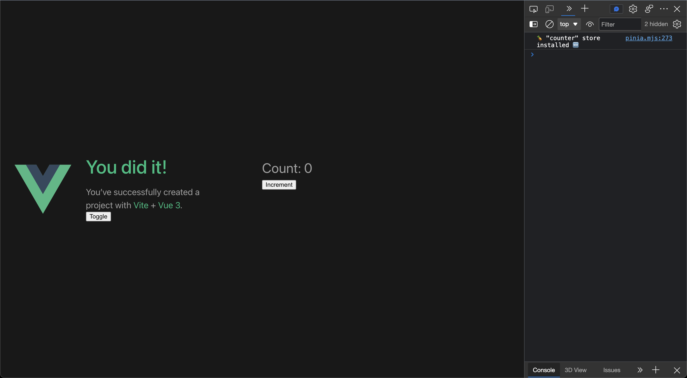
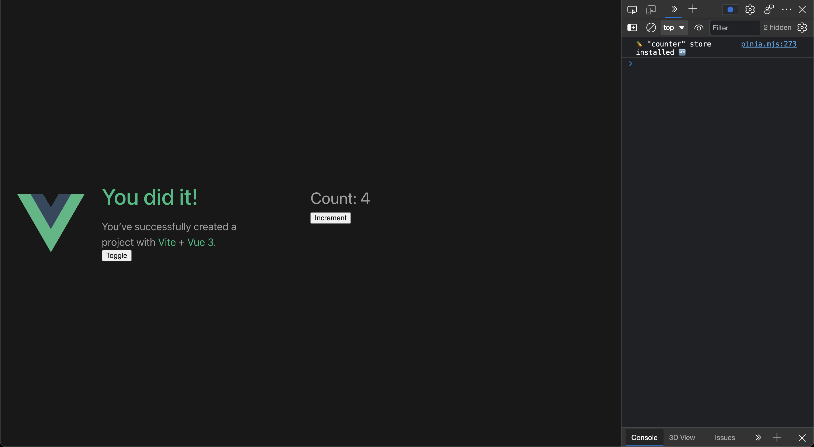
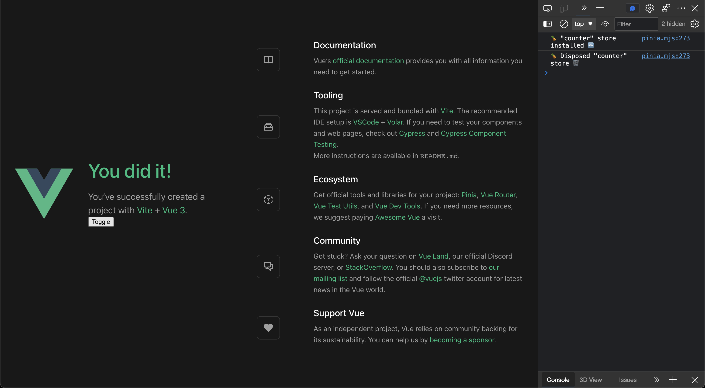
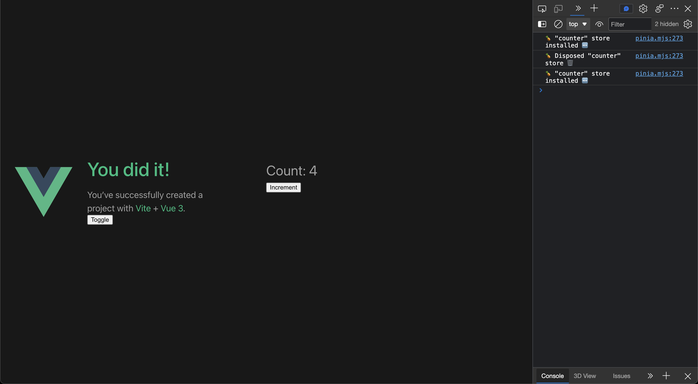

# repro-pinia-dispose-issue

[](https://stackblitz.com/github/DevilTea/repro-pinia-dispose-issue)

## Reproduce Steps

1. Click the "Toggle" button on the left, the first time the store is installed.


1. Click the "Increment" button on the right several times, and check the number of counts.


1. Click the "Toggle" button on the left again, the store is disposed.


1. Click the "Toggle" button on the left again, the store is installed, but its state is restored.


## Recommended IDE Setup

[VSCode](https://code.visualstudio.com/) + [Volar](https://marketplace.visualstudio.com/items?itemName=Vue.volar) (and disable Vetur) + [TypeScript Vue Plugin (Volar)](https://marketplace.visualstudio.com/items?itemName=Vue.vscode-typescript-vue-plugin).

## Customize configuration

See [Vite Configuration Reference](https://vitejs.dev/config/).

## Project Setup

```sh
pnpm install
```

### Compile and Hot-Reload for Development

```sh
pnpm dev
```

### Compile and Minify for Production

```sh
pnpm build
```

### Lint with [ESLint](https://eslint.org/)

```sh
pnpm lint
```
